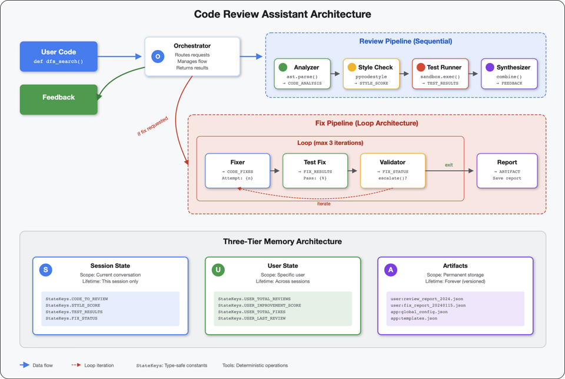

# AI Code Review Assistant ADK

This repository is an implementation of the [Google Codelab: Build a Code Review Assistant with the Gemini API](https://codelabs.developers.google.com/adk-code-reviewer-assistant/instructions?hl=en#0).

The codelab guides you through the process of building a code review assistant using the Gemini API. This repository contains the resulting code from following that codelab.

